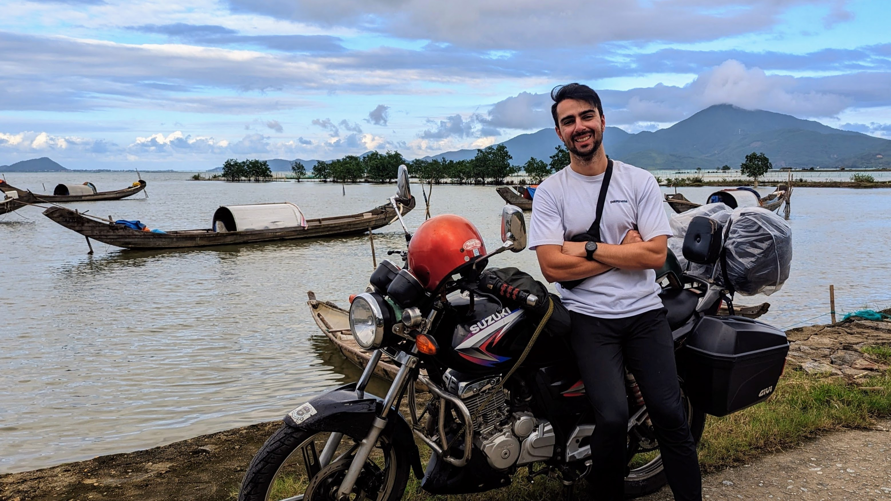

I'm an Australian PhD researcher in artificial intelligence and computer vision at the Australian National University in Canberra, Australia. My supervisors are [Dylan Campbell](https://sites.google.com/view/djcampbell), [Stephen Gould](https://users.cecs.anu.edu.au/~sgould/), and [Hongdong Li](https://users.cecs.anu.edu.au/~hongdong/). My research focuses on 3D reconstruction from limited data (creating 3D models from 2D images), basically helping computers see and understand the world in three dimensions, even when they don't have all the pieces of the puzzle.

{: .center-block :}

My [LinkedIn is here](https://www.linkedin.com/in/sambahrami/), and my [GitHub is here](https://github.com/SamBahrami/).

I'm also involved in AI safety research, particularly evaluating large language models using [algorithmic information theory](https://en.wikipedia.org/wiki/Algorithmic_information_theory). I'm always interested in meeting new people and hearing about potential collaborations. If you'd like to get in touch with me, please email me at sam [dot] bahrami [at] anu [dot] edu [dot] au.

---

## 📚 Work

**We had a paper accepted** on single view 3D room reconstruction at [AJCAI](https://ajcai2025.org/): [Room Envelopes: A Synthetic Dataset for Indoor Layout Reconstruction from Images](/room_envelopes) **(Oral) (Best Poster Award Winner)**

**First PhD publication** [PlückeRF: A Line-based 3D Representation for Few-view Reconstruction](https://github.com/SamBahrami/PluckeRF) at CVPR 2025

**AI Safety Evaluation Framework for LLMs (£40,000 grant)** Awarded [UK AI Safety Institute bounty](https://www.aisi.gov.uk/work/evals-bounty) to design an evaluation framework for detecting sandbagging in AI systems built on algorithmic information theory, applying Kolmogorov complexity as a measure of behavioural simplicity vs. strategic concealment

**Co-author** [The Edge of Disaster: A Battle Between Autonomous Racing and Safety](https://arxiv.org/abs/2206.15012)

---

## 💼 Experience

**PhD Researcher** at the Australian National University (2023-present)   

**Machine Learning and Research Engineer** (2018-2023)  
[Australian Institute for Machine Learning](https://www.adelaide.edu.au/aiml/) and [Australian Centre for Robotic Vision](https://en.wikipedia.org/wiki/Australian_Centre_for_Robotic_Vision) working with [Ian Reid](https://scholar.google.com/citations?user=ATkNLcQAAAAJ&hl=en), [Tat-Jun Chin](https://scholar.google.com/citations?user=WyqGF10AAAAJ&hl=en) and [Anton Van Den Hengel](https://scholar.google.com/citations?user=nMGZ2ZQAAAAJ&hl=en)

<!-- **Software Engineer** (2016-2019)

**Bachelor of Electrical and Electronic Engineering (Honours)** (2016)  
University of Adelaide

**Bachelor of Mathematics and Computer Science** (2016)  
University of Adelaide -->

---

## 🌍 Places & Engagements

**[2026 ML Summer School (MLSS) Melbourne](https://www.mlss-melbourne.com/)** attending machine learning summer school "The Future of AI Beyond LLMs" in Melbourne, Australia, met some great people! [(photo)](photos/IMG_7487.jpg) 

**[2025 AJCAI](https://ajcai2025.org/)** in Canberra, Australia presenting [Room Envelopes](/room_envelopes)

**[2025 CVPR](https://cvpr.thecvf.com/)** presenting [PlückeRF: A Line-based 3D Representation for Few-view Reconstruction](https://arxiv.org/abs/2506.03713) [(photo)](photos/cvpr_poster.JPG)

**[2025 Research @ Sydney Google Event](https://blog.google/intl/en-au/company-news/technology/research-sydney-charting-new-ai-frontiers-alongside-the-research-ecosystem-in-australia/)**

**[2025 AMSI Summer School ](https://amsi.org.au/events/event/amsi-summer-school-2025/)** enrolled in Elliptic PDEs from an Elementary Viewpoint by [Enrico Valdinoci](https://research-repository.uwa.edu.au/en/persons/enrico-valdinoci), and Optimal transportation and Monge-Ampère equations by [Jiakun Liu](https://sites.google.com/view/jiakunl/home/research) [(photo)](photos/amsi-2025.jpg)

**[2024 Australian AI Safety Forum](https://aisafetyforum.au/)** [(photo)](photos/ai-safety-forum-2024.jpg) 

**[2024 ANU Hackathon](https://www.anu.edu.au/students/student-life/events-stories/anu-hackathon-produces-innovative-ai-enabled-healthcare-solutions)** Healthcare and AI themed, second place [(photo)](photos/anu-hackathon-2024.jpg)

**[2023 Made a public art vending machine](https://www.adelaide.edu.au/aiml/news/list/2023/03/20/ai-art-vending-machine-seeks-human-connection-not-money)** for the city of Adelaide [(photo)](photos/art-vending-machine.jpg)

**[2022 Learn2Race Challenge](https://www.aicrowd.com/challenges/learn-to-race-autonomous-racing-virtual-challenge)** Virtual racing competition winners, [paper published at ICML](https://arxiv.org/abs/2206.15012)

<!-- **[South Australian Science and Innovation awards](https://www.scienceawards.sa.gov.au/2021-winners)** excellence in science and industry collaboration winners, as part of the Australian Institute for Machine Learning industry solutions team [(photo)](photo/science-industry.jpg) -->

**[2021 Developer on the NASA Robotics Challenge University of Adelaide team](https://www.adelaide.edu.au/aiml/news/list/2021/10/06/aiml-key-in-nasa-prize-winning-innovation)** won a $75k USD prize, paper published to [ICRA 2022](https://arxiv.org/abs/2109.12109)

**[2019 Govhack Hackathon](https://www.adelaide.edu.au/aiml/news/list/2019/10/21/team-artificially-intelligent-win-at-govhack-2019)** winners
