We introduce Room Envelopes, a synthetic dataset that provides **dual pointmap representations** for indoor scene reconstruction. Each image comes with three complementary views: RGB image, visible surface (depth and normals), and layout surface (depth and normals), with examples below. The **visible surface** captures all directly visible geometry including furniture and objects, while the **layout surface** shows structural elements as they would appear without occlusion. This dual representation enables direct supervision for layout reconstruction in occluded regions.

<div style="margin: 4rem 0;">
  <h3 style="text-align: center; margin-bottom: 2rem; color: #2c3e50;">Example 1: ai_011_009-cam_00-9</h3>
  <div style="background: #f8f9fa; padding: 3rem 2rem; border-radius: 15px; margin-bottom: 3rem;">
    <div style="display: grid; grid-template-columns: repeat(3, 1fr); gap: 2rem; align-items: center; max-width: 1400px; margin: 0 auto;">
      <div style="text-align: center;">
        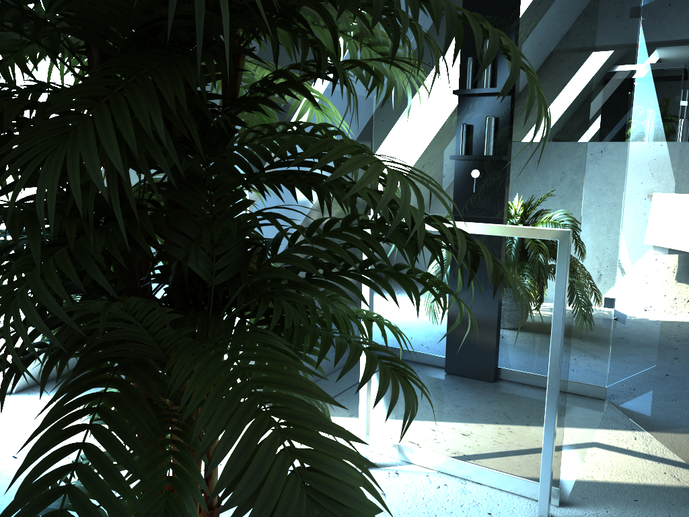
        <h4 style="margin-top: 1rem; font-size: 1.1rem; color: #2c3e50; font-weight: 600;">RGB Image</h4>
      </div>
      <div style="text-align: center;">
        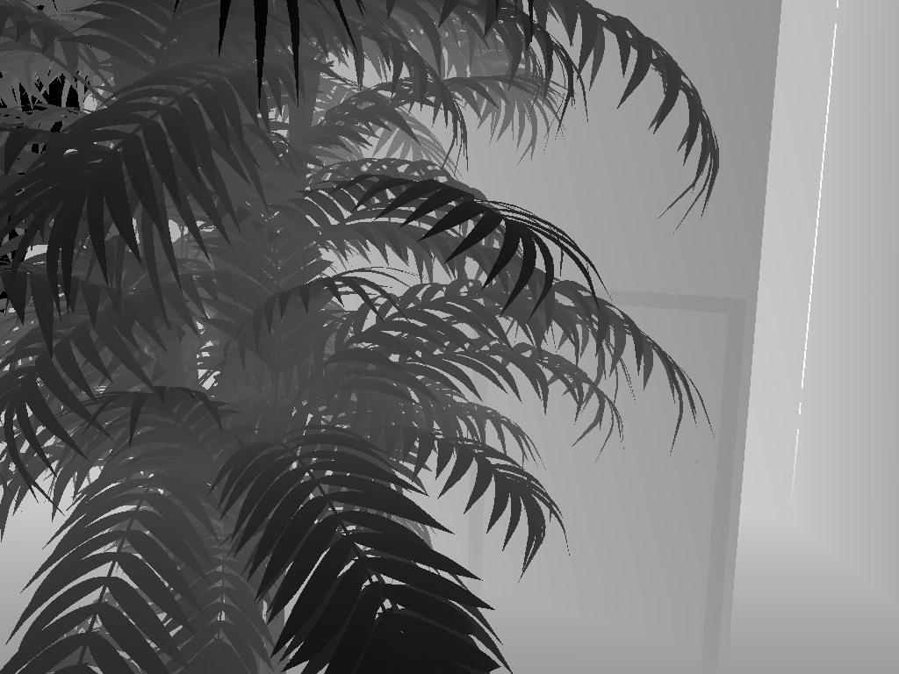
        
        <h4 style="margin-top: 1rem; font-size: 1.1rem; color: #2c3e50; font-weight: 600;">Visible Surface</h4>
        <p style="margin-top: 0.5rem; color: #666; font-size: 0.9rem;">Depth & Normals</p>
      </div>
      <div style="text-align: center;">
        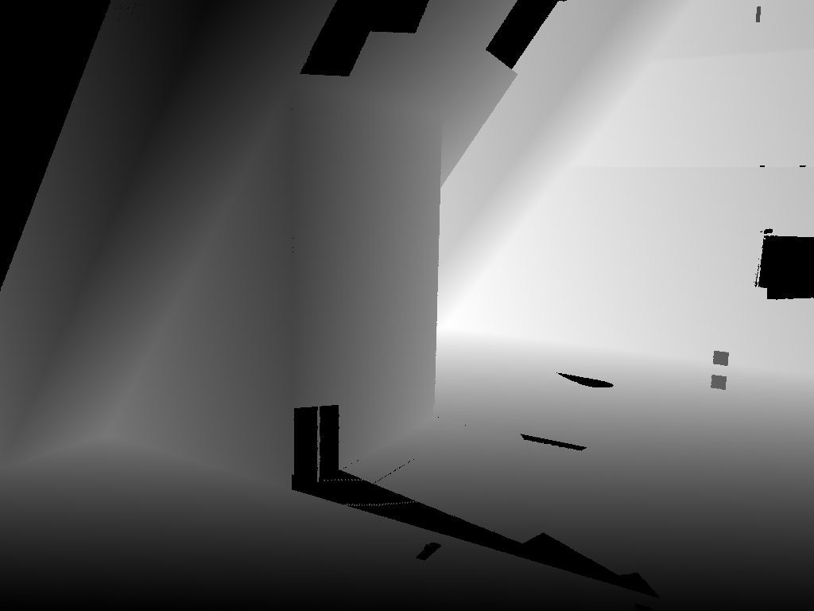
        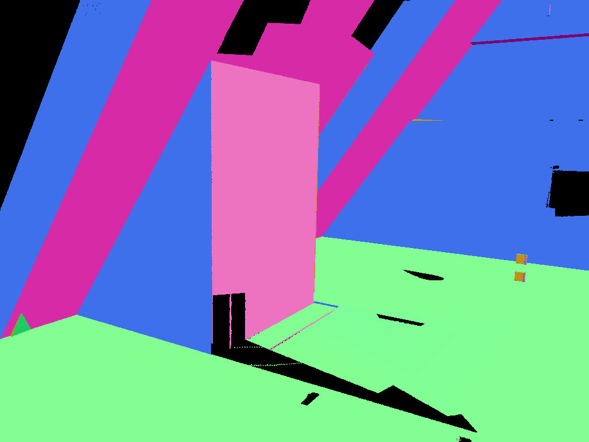
        <h4 style="margin-top: 1rem; font-size: 1.1rem; color: #2c3e50; font-weight: 600;">Layout Surface</h4>
        <p style="margin-top: 0.5rem; color: #666; font-size: 0.9rem;">Depth & Normals</p>
      </div>
    </div>
  </div>

  <h3 style="text-align: center; margin-bottom: 2rem; color: #2c3e50;">Example 2: ai_030_009-cam_00-70</h3>
  <div style="background: #f8f9fa; padding: 3rem 2rem; border-radius: 15px; margin-bottom: 3rem;">
    <div style="display: grid; grid-template-columns: repeat(3, 1fr); gap: 2rem; align-items: center; max-width: 1400px; margin: 0 auto;">
      <div style="text-align: center;">
        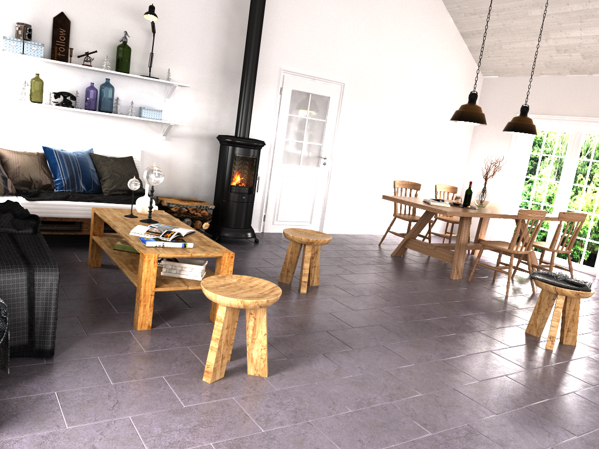
        <h4 style="margin-top: 1rem; font-size: 1.1rem; color: #2c3e50; font-weight: 600;">RGB Image</h4>
      </div>
      <div style="text-align: center;">
        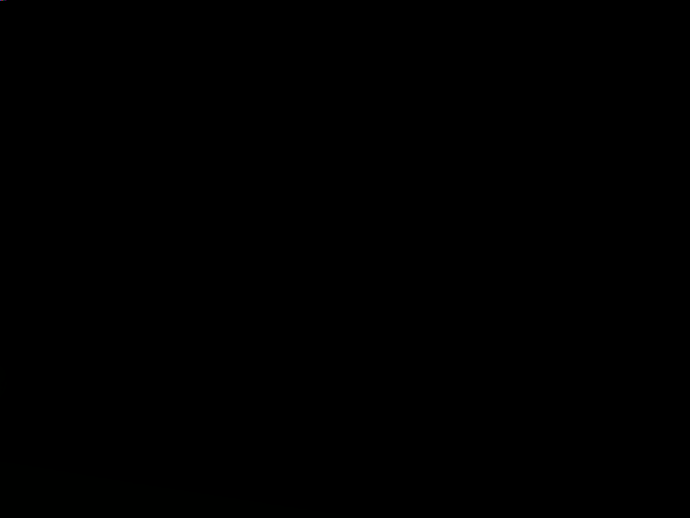
        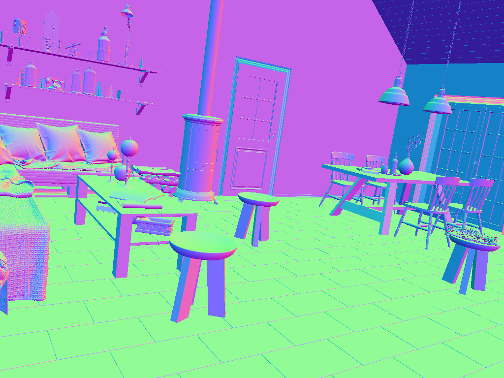
        <h4 style="margin-top: 1rem; font-size: 1.1rem; color: #2c3e50; font-weight: 600;">Visible Surface</h4>
        <p style="margin-top: 0.5rem; color: #666; font-size: 0.9rem;">Depth & Normals</p>
      </div>
      <div style="text-align: center;">
        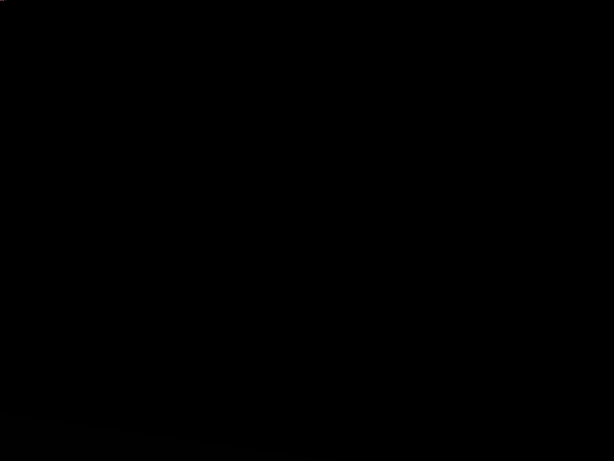
        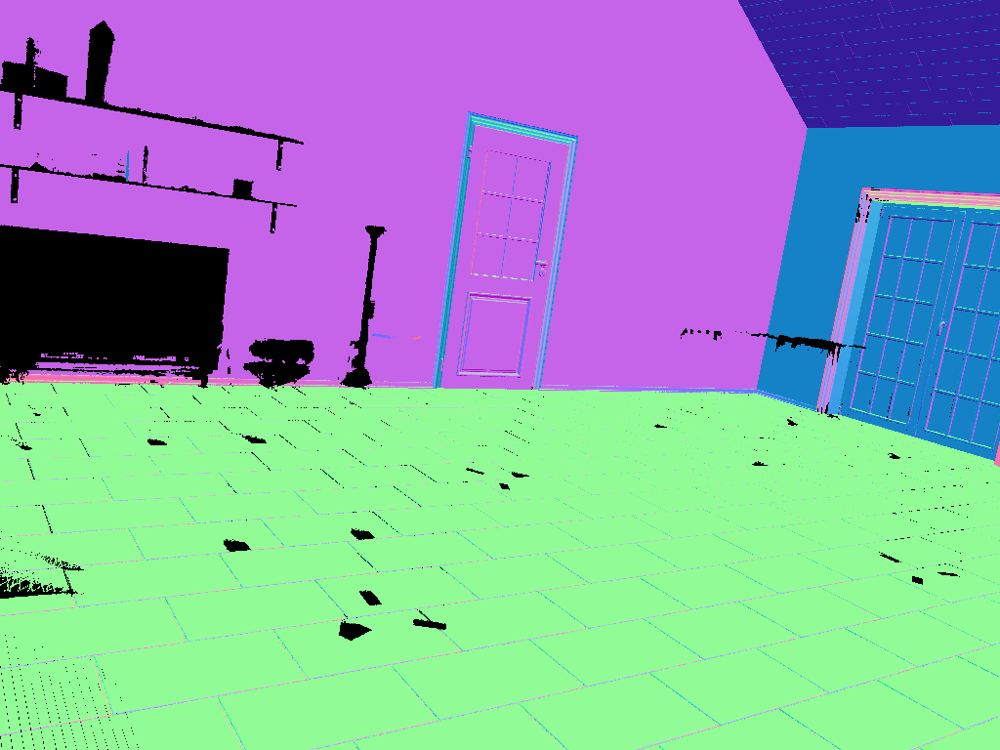
        <h4 style="margin-top: 1rem; font-size: 1.1rem; color: #2c3e50; font-weight: 600;">Layout Surface</h4>
        <p style="margin-top: 0.5rem; color: #666; font-size: 0.9rem;">Depth & Normals</p>
      </div>
    </div>
  </div>

</div>

---

## Abstract

Modern scene reconstruction methods are able to accurately recover 3D surfaces that are visible in one or more images. However, this leads to incomplete reconstructions, missing all occluded surfaces. While much progress has been made on reconstructing entire objects given partial observations using generative models, the structural elements of a scene, like the walls, floors and ceilings, have received less attention.

We argue that these scene elements should be relatively easy to predict, since they are typically planar, repetitive and simple, and so less costly approaches may be suitable. In this work, we present a synthetic dataset—**Room Envelopes**—that facilitates progress on this task by providing a set of RGB images and two associated pointmaps for each image: one capturing the visible surface and one capturing the first surface once fittings and fixtures are removed, that is, the structural layout.

As we show, this enables direct supervision for feed-forward monocular geometry estimators that predict both the first visible surface and the first layout surface. This confers an understanding of the scene's extent, as well as the shape and location of its objects.

---

## <a name="dataset"></a>Dataset Details

For each camera pose, the dataset provides:
- RGB image
- Visible surface pointmap (first visible depth)
- Layout surface pointmap (structural elements only)
- Camera intrinsics and extrinsics
- Surface normals

---

## Key Contributions

1. **Room Envelopes Dataset**: An indoor synthetic dataset providing an image, a visible surface pointmap, and a layout surface pointmap for each camera pose

2. **Feed-forward Scene Reconstruction**: A model demonstrating effective room layout estimation using this dataset

3. **Novel Representation**: The only dataset providing both first visible depth and layout depth representations for comprehensive indoor scene understanding

---

## Why Room Envelopes?

### The Problem with Existing Approaches

Current models for indoor scene reconstruction typically use depth images or layered depth representations for training, but these formats have inherent limitations:

- **Depth maps** only capture the first visible surface, losing information about underlying room structure
- **Layered depth** creates artificial discontinuities where continuous surfaces are fragmented across layers
- Feed-forward models struggle at **occlusion edges**, predicting averaged depth rather than decisive geometry
- Many existing layout estimation methods rely on a **planar assumption**, assuming all room surfaces (walls, floors, ceilings) are perfectly flat planes, which limits their applicability to more complex architectural geometries

### Our Solution

Room Envelopes addresses these limitations by providing:

- **Structural Clarity** - Unoccluded views of room boundaries  
- **Direct Supervision** - Pixel-aligned supervision for layout estimation  
- **Less Ambiguity** - No uncertainty about layer assignment  

---

## Layout Estimation on Real-World Examples

We trained a layout estimation model by fine-tuning a feed-forward depth estimator, and ran it on real-world indoor scenes. The model, trained exclusively on our synthetic dataset, shows promising generalization capabilities to real-world environments.
<div style="display: grid; grid-template-columns: repeat(3, 1fr); gap: 20px; margin: 2rem 0;">
  <div style="text-align: center;">
    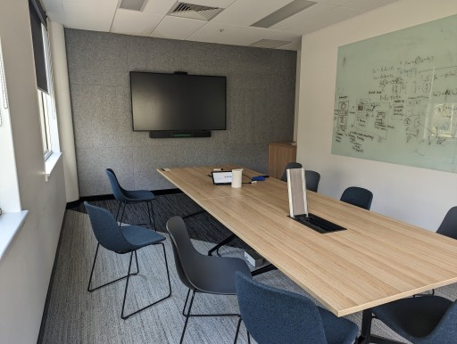
    <p style="font-weight: 600; color: #2c3e50; margin-top: 0.5rem; font-size: 0.9rem;">Real-World RGB Image</p>
  </div>
  <div style="text-align: center;">
    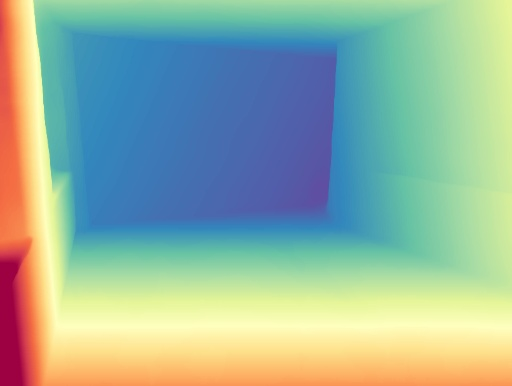
    <p style="font-weight: 600; color: #2c3e50; margin-top: 0.5rem; font-size: 0.9rem;">Predicted Layout Depth</p>
  </div>
  <div style="text-align: center;">
    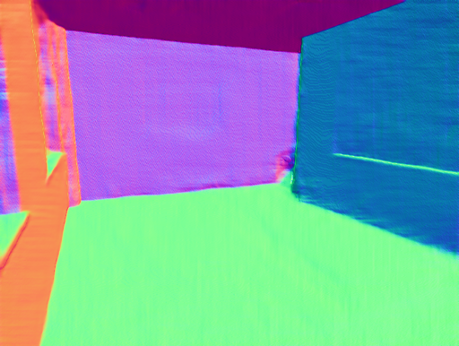
    <p style="font-weight: 600; color: #2c3e50; margin-top: 0.5rem; font-size: 0.9rem;">Predicted Layout Normals</p>
  </div>
</div>

<div style="display: grid; grid-template-columns: repeat(3, 1fr); gap: 20px; margin: 2rem 0;">
  <div style="text-align: center;">
    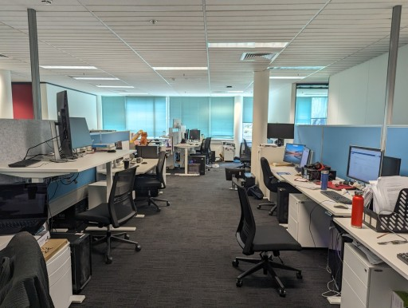
    <p style="font-weight: 600; color: #2c3e50; margin-top: 0.5rem; font-size: 0.9rem;">Real-World RGB Image</p>
  </div>
  <div style="text-align: center;">
    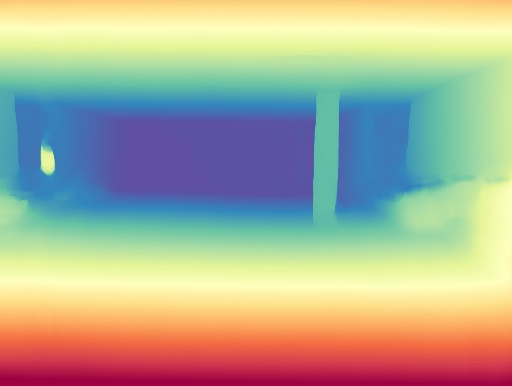
    <p style="font-weight: 600; color: #2c3e50; margin-top: 0.5rem; font-size: 0.9rem;">Predicted Layout Depth</p>
  </div>
  <div style="text-align: center;">
    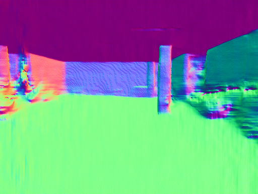
    <p style="font-weight: 600; color: #2c3e50; margin-top: 0.5rem; font-size: 0.9rem;">Predicted Layout Normals</p>
  </div>
</div>

<div style="display: grid; grid-template-columns: repeat(3, 1fr); gap: 20px; margin: 2rem 0;">
  <div style="text-align: center;">
    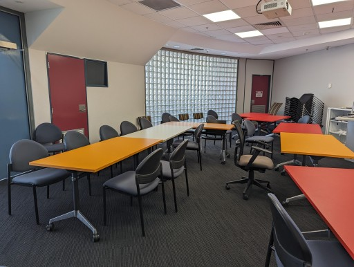
    <p style="font-weight: 600; color: #2c3e50; margin-top: 0.5rem; font-size: 0.9rem;">Real-World RGB Image</p>
  </div>
  <div style="text-align: center;">
    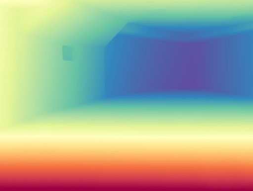
    <p style="font-weight: 600; color: #2c3e50; margin-top: 0.5rem; font-size: 0.9rem;">Predicted Layout Depth</p>
  </div>
  <div style="text-align: center;">
    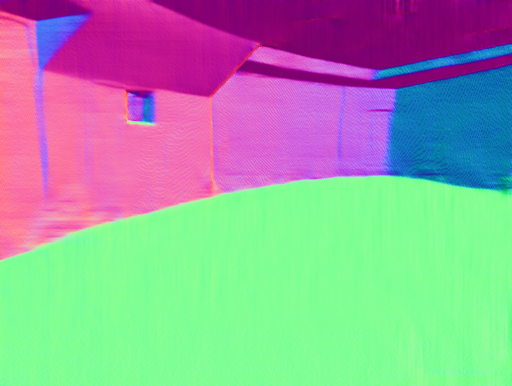
    <p style="font-weight: 600; color: #2c3e50; margin-top: 0.5rem; font-size: 0.9rem;">Predicted Layout Normals</p>
  </div>
</div>

<div style="display: grid; grid-template-columns: repeat(3, 1fr); gap: 20px; margin: 2rem 0;">
  <div style="text-align: center;">
    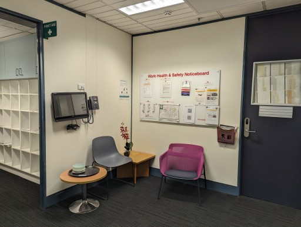
    <p style="font-weight: 600; color: #2c3e50; margin-top: 0.5rem; font-size: 0.9rem;">Real-World RGB Image</p>
  </div>
  <div style="text-align: center;">
    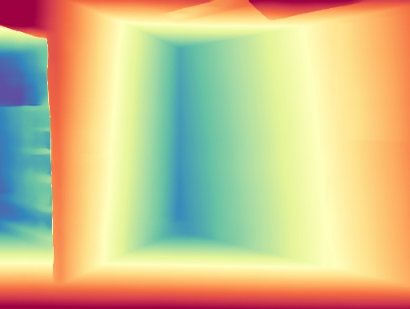
    <p style="font-weight: 600; color: #2c3e50; margin-top: 0.5rem; font-size: 0.9rem;">Predicted Layout Depth</p>
  </div>
  <div style="text-align: center;">
    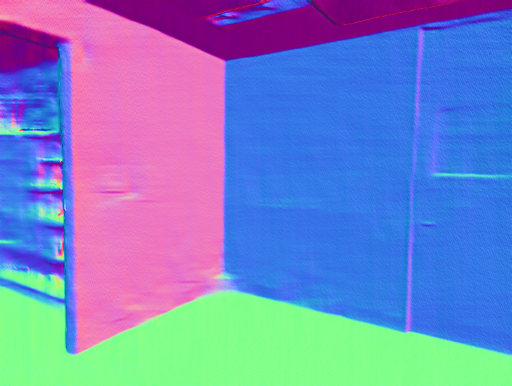
    <p style="font-weight: 600; color: #2c3e50; margin-top: 0.5rem; font-size: 0.9rem;">Predicted Layout Normals</p>
  </div>
</div>

---

## <a name="paper"></a>Citation

If you find Room Envelopes useful for your research, please cite:

```bibtex
@inproceedings{bahrami2025roomenvelopes,
  title={Room Envelopes: A Synthetic Dataset for Indoor Layout Reconstruction from Images},
  author={Bahrami, Sam and Campbell, Dylan},
  booktitle={Australasian Joint Conference on Artificial Intelligence (AJCAI)},
  year={2025}
}
```

